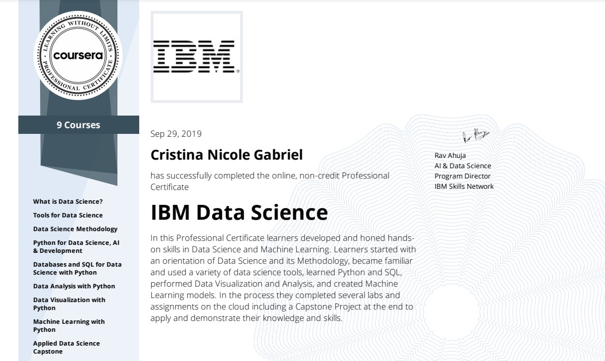
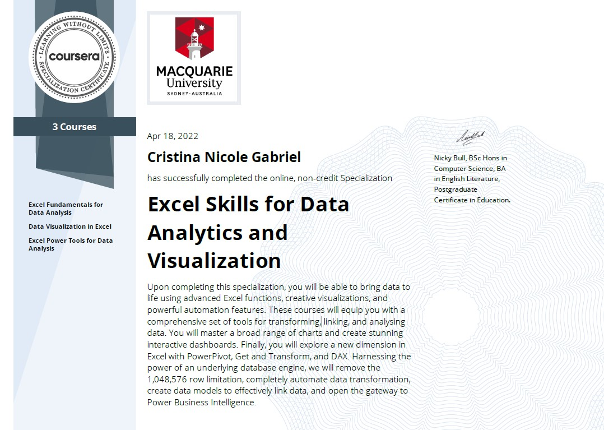

# Current Skills

Continuing my education and learning is a passion of mine and therefore I continuously seek courses and training. You will find a list of my current skill sets and corresponding training. 
   <strong>Skills:</strong>
  <ul>
    <li> Programming Languages: Python, SQL and R </li> 
    <li> Data Analysis Tools: Excel, Tableau </li> 
    <li> Database Management Tools: MySQL, PostgreSQL </li> 
    <li> Cloud Based Tools: AWS </li> 
    <li> Machine Learning: scikit-learn, TensorFlow, PyTorch </li> 
    <li> Mathematics: Biostatistics, Calculus </li> 
  </ul>
    

*** 

# Certificates
#### IBM Certification in Data Science

Skills Obtained: 

    - Python 
    - SQL
    - R
    - Git
    - Machine Learning
    - Deep Learning
    - SciKit-Learn and Sci-Py
    - Matplotlib, Seaborn, and Folium
    - Dash and Plotly
    - Cloud Databases 
 

#### Excel for Data Visualization and Analysis

Skills Obtained: 

    - Excel 
    - PowerPivot
    - PowerQuery
    - PowerBi
    - Data Visualization
    - DAX  
    - Macros
   

#### Bachelors of Science; Neuroscience
3.7 GPA from Georgia State University Graduating Cum Laude.  

Relevant Coursework: Biostatistics, Pre-Calculus, Calculus I, Calculus II
