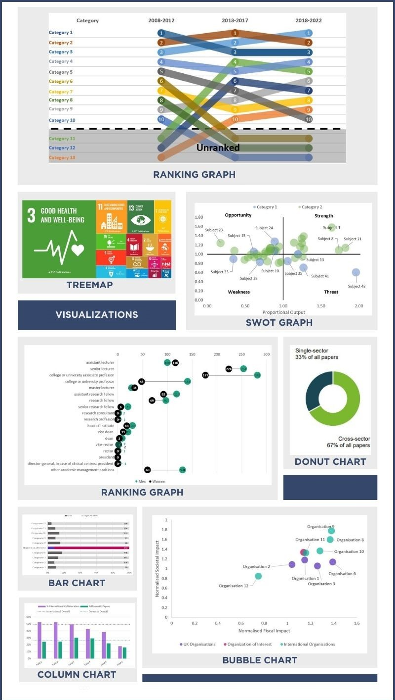

# Portfolio
---
### Projects
[Identifying Family-Friendly Neighborhoods in London, UK using **K-means Clustering**](https://github.com/kristy1620/Coursera_Capstone/blob/master/London_Data_Report.pdf)

[Transforming image into a pencil sketch using **OpenCV**](https://github.com/kristy1620/kristy1620.github.io/blob/main/documents/drawing_code.ipynb)

[Research Evaluation Report for Large European public private partnership](https://www.ihi.europa.eu/sites/default/files/uploads/Documents/About/Reports/IHI_Bibliometrics_Report_2023_Final.pdf)

---
### Sample of Data Visualisations

 

